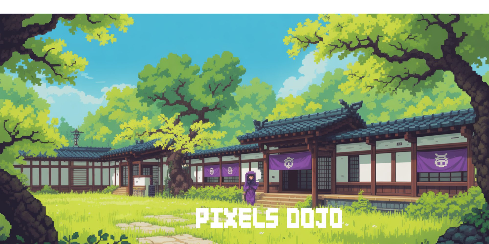

# 🎮 Pixels Dojo Wiki

A beautiful, feature-rich community wiki for Pixels Online with NPC management, user authentication, and dynamic content.



## ✨ Features

- 🎭 **NPC Directory** - Complete searchable NPC guide with images and locations
- 🛠️ **Admin Panel** - Easy-to-use interface for managing NPCs (add/edit/delete)
- 👤 **User Authentication** - Login system with admin controls
- 📝 **Dynamic Pages** - Wiki-style pages with like/dislike system
- 💬 **Question Submission** - Users can submit questions via email
- 🎨 **Beautiful UI** - Neon-themed design with smooth animations
- 📱 **Responsive** - Works perfectly on mobile, tablet, and desktop

## 🚀 Quick Start (Local Development)

1. **Clone the repository**
   ```bash
   git clone <your-repo-url>
   cd pixels-dojo-final
   ```

2. **Install dependencies**
   ```bash
   npm install
   ```

3. **Start the server**
   ```bash
   npm start
   ```

4. **Access the site**
   - Main site: `http://localhost:3000`
   - Admin panel: `http://localhost:3000/admin`
   - NPCs page: `http://localhost:3000/npcs`

## 🔐 Default Admin Login

- **Email**: `lizzylizzysims@gmail.com`
- **Password**: `changeme123`

⚠️ **IMPORTANT**: Change this password immediately after first login!

## 📸 Adding NPC Images

You have **two options** for adding NPC images:

### Option 1: Upload via Admin Panel (Easiest)
1. Login at `/admin`
2. Click "➕ Add New NPC" or "✏️ Edit" on existing NPCs
3. Upload images directly through the form (200x200px recommended)

### Option 2: Bulk Upload to Folder
1. Place all your NPC images in `public/images/npcs/`
2. Name them clearly (e.g., `barney.png`, `margaret.png`)
3. Use the admin panel to assign images to NPCs

**Note**: 54 NPCs are already seeded in the database from your alphabetical list. You just need to add the images!

## 🌐 Deployment to Production

Your best options for deployment (all are FREE):

### ⭐ Option 1: Vercel (RECOMMENDED - Easiest!)

**Why Vercel?** Easiest setup, auto-deploys from GitHub, free SSL, perfect for Node.js

1. **Push to GitHub**
   ```bash
   git init
   git add .
   git commit -m "Initial commit - Pixels Dojo Wiki"
   git branch -M main
   git remote add origin <your-github-repo-url>
   git push -u origin main
   ```

2. **Deploy on Vercel**
   - Go to [vercel.com](https://vercel.com) (sign up with GitHub)
   - Click "New Project"
   - Import your GitHub repository
   - Vercel auto-detects settings ✅
   - Click "Deploy" 🚀
   - **Done!** You'll get a URL like `pixels-dojo.vercel.app`

3. **Add Custom Domain** (optional)
   - In Vercel dashboard → Settings → Domains
   - Add your custom domain (e.g., `pixelsdojo.com`)

### Option 2: Netlify

1. **Create build configuration** (already included as `netlify.toml`)

2. **Deploy**
   - Go to [netlify.com](https://netlify.com)
   - Click "Add new site" → "Import from Git"
   - Connect your GitHub repository
   - Build command: `npm install`
   - Publish directory: `public`
   - Deploy!

### Option 3: Railway.app

1. Go to [railway.app](https://railway.app)
2. Click "New Project" → "Deploy from GitHub"
3. Select your repository
4. Railway auto-configures and deploys 🎉

### Option 4: Render.com

1. Go to [render.com](https://render.com)
2. Click "New +" → "Web Service"
3. Connect GitHub repo
4. Build command: `npm install`
5. Start command: `npm start`
6. Deploy!

## ⚙️ Environment Variables (Optional)

For email functionality, create a `.env` file or add in your hosting platform:

```env
EMAIL_USER=your-email@gmail.com
EMAIL_PASS=your-gmail-app-password
PORT=3000
```

**To get Gmail App Password:**
1. Google Account → Security → 2-Step Verification
2. App Passwords → Generate for "Mail"
3. Use the 16-character password

## 📁 Project Structure

```
pixels-dojo-final/
├── public/
│   ├── css/              # Stylesheets
│   │   ├── style.css     # Main styles
│   │   ├── npcs.css      # NPC page styles
│   │   └── admin.css     # Admin panel styles
│   ├── images/           # Images and assets
│   │   ├── npcs/         # ⬅️ PUT YOUR NPC IMAGES HERE
│   │   └── ...           # Logos, banners, etc.
│   └── js/               # Client-side JavaScript
│       ├── main.js       # Main functionality
│       └── admin.js      # Admin panel functionality
├── views/                # EJS templates
│   ├── index.ejs         # Homepage
│   ├── npcs.ejs          # NPC directory (columnar layout)
│   ├── admin.ejs         # Admin panel
│   ├── page.ejs          # Wiki pages
│   └── login.ejs         # Login page
├── server.js             # Express server & routes
├── database.js           # Database setup & NPC seeds
├── package.json          # Dependencies
├── .gitignore            # Git ignore rules
└── README.md             # This file
```

## 🎨 Customization

### Changing Colors

Edit `public/css/style.css`:

```css
:root {
    --neon-purple: #6500ff;
    --cyan: #00ffff;
    --lime: #edff84;
    --bg-color: #0a0a15;
}
```

### Managing NPCs

**Via Admin Panel** (`/admin`):
- ➕ Add new NPCs
- ✏️ Edit existing NPCs
- 🗑️ Delete NPCs
- 🔢 Change display order
- 📸 Upload/change images

### Adding Wiki Pages

Add content pages via database or create an extended admin panel (coming soon!)

## 🐛 Troubleshooting

| Problem | Solution |
|---------|----------|
| Database not creating | Ensure write permissions, delete `pixels-dojo.db` and restart |
| Images not uploading | Check `public/images/npcs/` folder exists with write permissions |
| Can't log in | Use default credentials above, check database exists |
| NPCs not showing | Check database seeded correctly, view `/admin` to verify |

## 🔄 Updating from GitHub

If you update your GitHub repo, platforms like Vercel/Netlify will auto-redeploy. For others:

```bash
git pull origin main
npm install  # if package.json changed
npm start    # restart server
```

## 📧 Support & Contact

- **Issues**: Open an issue on GitHub
- **Email**: lizzylizzysims@gmail.com
- **Discord**: Join the Pixels community

## 🎯 Next Steps

1. ✅ Deploy to Vercel/Netlify
2. 📸 Add your NPC images to `public/images/npcs/`
3. 🛠️ Use admin panel to assign images to NPCs
4. 🎨 Customize colors if desired
5. 📝 Add more wiki content
6. 🌍 Share with the Pixels community!

## 📄 License

Open source - free for community use. Not affiliated with Pixels or Animoca Brands.

---

Built with ❤️ for the Pixels Online community by Lizzy Sims
